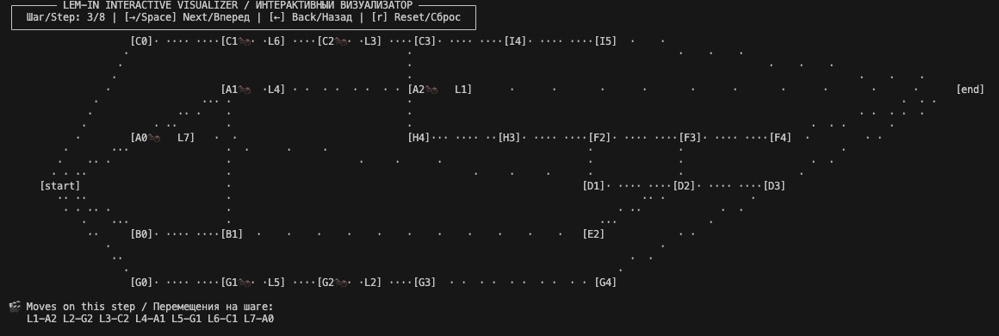

# Lem-in: Ant Farm Simulation

[Read this in Russian (Читать на русском)](https://github.com/heysaleme/lem-in/blob/main/README.ru.md)


The project is an efficient logistics manager for a digital ant farm. The program's task is to find the quickest way to move ants from the `##start` room to the `##end` room through a tangled network of tunnels.



## 🐜 Project Essence

Imagine you have a map of rooms connected by tunnels. Only **one** ant can be in each room at a time (except for start and finish), and only one ant can pass through each tunnel in a single turn.

**Goal:** Output a list of moves such that the last ant reaches the finish in the minimum possible number of steps.

<br>

## How to Run

To run the program, you need [Go](https://go.dev/) installed.

1. **Clone the repository:**

```bash
git clone <your-repository-link>
cd lem-in

```

2. **Run the program with a map file:**

```bash
go run ./cmd/lem-in <exampleNN.txt>

```

<br>

### 📺 Interactive Visualization (TUI)

A visualizer is provided for a clear display of the algorithm's work in the terminal. It supports manual step control.

**Run via pipeline (Pipe):**

```bash
go run ./cmd/lem-in <map.txt> | go run ./cmd/visualizer

```

**Controls:**

* **`→` / `Space**` — Next step (ants move).
* **`←`** — Previous step (rewind).
* **`r`** — Reset animation to the beginning.
* **`q`** — Exit the visualizer.

<br>

### Output Example:

```text
L1-t L2-h L3-o
L1-E L2-A L3-o L4-t L5-h
...

```

Where `L1-t` means: Ant #1 moved to room `t`.

<br>

## Input Data Format

The program accepts a text file describing the colony. The format is strictly defined:

```text
3           # Number of ants
##start     # Command: the next line is the entrance to the anthill
1 23 3      # Room name and its coordinates (X Y)
2 16 7      # Another room
##end       # Command: the next line is the exit
3 16 3      # Final room
1-2         # Connection (tunnel) between room 1 and 2
2-3         # Connection between room 2 and 3

```

**Data Requirements:**

* Room names cannot start with the letter `L` or the `#` symbol.
* Coordinates must be integers.
* Rooms must be connected by tunnels, otherwise the ants will not find the exit.
* The map must contain exactly one `##start` command and one `##end` command.

<br>

## Project Architecture

```text
lem-in/
├── cmd/
│   ├── lem-in/          # Main pathfinding logic.
│   └── visualizer/      # Interface for movement visualization (TUI).
├── internal/
│   ├── models/          # Describes general data structures (`Ant`, `Room`, `Path`, `Farm`).
│   ├── parser/          # Responsible for reading text files and creating the primary farm structure.
│   ├── graph/           # Turns text data into a mathematical graph (adjacency list).
│   ├── solver/          # Uses pathfinding algorithms and combinatorial logic to choose the most efficient route.
│   ├── simulation/      # Moves ants step-by-step along selected paths, ensuring they do not collide.
│   └── formatter/       # Outputs the result to the console according to the required format.
└── examples/            # Examples for tests

```

<br>

## Algorithmic Logic

1. **Recursive Path Discovery:** Depth-First Search (DFS) with backtracking is used to find all potential routes.
2. **Disjoint Set Optimization:** The algorithm filters paths, creating combinations of non-overlapping nodes.
3. **Time Complexity Prediction:** A formula is applied for ant distribution to minimize the total waiting time in the queue.
4. **Greedy Dispatching:** Distribution of ants across paths occurs dynamically — each subsequent unit chooses the route with the shortest exit time.

<br>

## Technologies

* **Programming Language:** Go (Golang)
* **Libraries:** [Bubble Tea](https://github.com/charmbracelet/bubbletea) (for TUI visualization).
* **Algorithms:** Adjacency lists, Depth-First Search (DFS), working with disjoint sets.
* **Optimization:** Combinatorial brute force, automatic graph scaling, and mathematical step prediction.